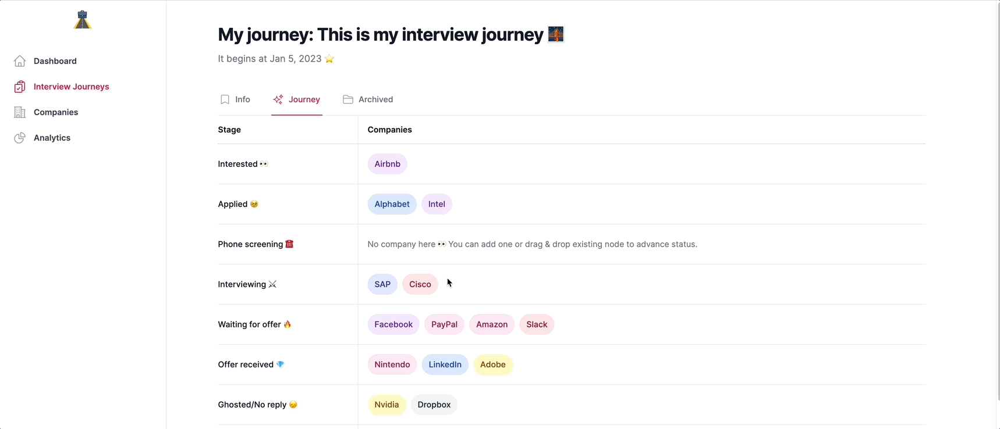

# RoadToJobs - The open-source Interview Tracking app 👀📝

    

Just as every journey holds significance, the same can be said for the numerous interview journeys throughout your lifetime 🌊.

Make it a point to diligently record and monitor every aspect of your interview journey with each company 🔥.

## Key Features 🚀

RoadToJobs helps you to:

- Create a journey for every interview period in your life.
- Mark a goal for the journey and start to tackle it.
- Track every status and proactively handle the progress of the interview.
- Noted everything, noted today, great lessons for tomorrow.
- Manage your own blocklist, personal avoid,... for future references.
- ...

We are all human, and we can't remember everything from the past, so we should have an appropriate platform to assist us.

RoadToJobs helps you to write & note every detail of your job-seeking journey.

RoadToJobs is an OSS application for single & self-hosted usage. 

## Technology
- NodeJS 18 x TypeScript
- [SurrealDB](https://surrealdb.com/)
- Vue 3 x TypeScript
- TailwindCSS for UI/UX

A simple VPS from **$5** (Vultr/DigitalOcean) can run RoadToJobs just lovely fine 🥹❤️. 
You don't need the NASA-server specs.

## Project Structure
RoadToJobs follows the monorepo strategy, each folder would contain their own README file.

- `server`: Backend
- `web`: Frontend
- `shared`: Stuff that can be used from both `server` & `web`
- `tests-e2e`: E2E test cases to test the Deployed Application.

## Documentation

Check out [RoadToJobs Documentation](https://docs.roadto.jobs)

## Testing

We are following 2 kinds of testing:

- E2E test cases
- [Manual test cases](https://docs.google.com/spreadsheets/d/1-7WR0pX-1RL8smjf7smPmHRPCdwjq6R0tqWQWfvxzsg/edit?usp=sharing)
    - We'll try our best to make them automated (save time & life 😉)

## Contributing
Thank you for considering contributing to the RoadToJobs! 
The contribution guide can be found in the [Contribution Documentation](https://docs.roadto.jobs/contributions)

## Code of Conduct
In order to ensure that the RoadToJobs community is welcoming to all, please review and abide by the Code of Conduct.

## Security Vulnerabilities
If you discover a security vulnerability within RoadToJobs, please send an e-mail to Seth Phat via [security@roadto.jobs](security@roadto.jobs). 
All security vulnerabilities will be promptly addressed.

## License
The RoadToJobs is open-sourced software licensed under the MIT license.
